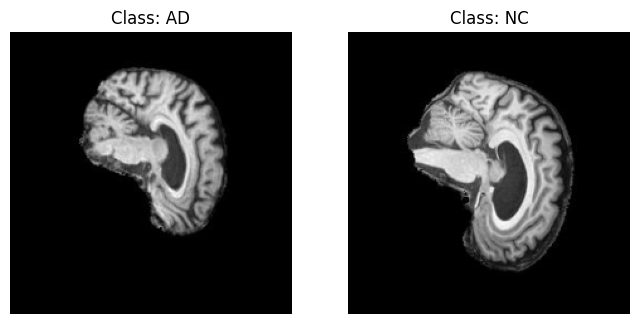

# Classification of Alzheimer's Disease using ConvNeXt

---

Student Number: 46990716
Student Name: Sophia Gleeson

## Table of contents

[Introduction](#introduction)
[ConvNeXt Overview](#convnext-overview)
[Dependencies](#dependencies)
[Usage](#usage)
[Dataset](#dataset)

## Introduction

Alzheimer's disease is an irreversible neurodegenerative disease caused by damage and deterioration of brain tissue, affects a person’s cognitive functions[^R1]. Given that Alzheimer's disease affects millions of people worldwide, the ability to accurately and effectively diagnose the disease is critical for earlier diagnosis, treatment planning and efficiency and patient care.

Though brain imaging is only one of the critical diagnostic steps, it is important to be able to identify even subtle changes in the brain.

This project aims to perform binary classification of 2D brain MRIs from the Alzheimer's Disease Neuroimaging Initiative (ADNI) dataset between subjects with Alzheimer's disease (AD) and subjects with Normal Cognition (NC). Using one of the latest vision models, ConvNeXt, I aim to achieve a minimum accuracy of 0.8 on the test set.

## ConvNeXt Overview

ConvNeXt was introduced in the paper *A ConvNet for the 2020s*[^2] as a convolutional neural network (CNN) modernised toward the design of a vision transformer (ViT). Through implementing aspects of ViTs architecture and using similar techniques used to train ViTs, Z. Liu et. all, kept the simplicity and efficiency of CNNs while achieving state of the art performance on image recognition tasks.

### Basic Building Block of ConvNeXt

The ConvNeXt Block is composed of a depthwise convolution, layer normalisation, pointwise convolutions and GELU activation.

The block starts with a 7x7 depthwise convolution, a special case of grouped convolutions, where the number of groups is equal to the number of channels. It operates on a per-channel basis, mixing information only in the spatial dimension and not across channels. The 7x7 kernel size is directly inspired by the large receptive fields of attention models in swim transformers. The features are then normalized using Layer Normalization, a standard in ViTs, instead of Batch Normalization. The final stage is channel mixing, which mimics ViTs MLP and is performer by two 1x1 pointwise convolutions. The first 1x1 convolution expands the number of channels, then the GELU activation function is applied, and the second 1x1 convolution projects the channels back down to the input dimension. These pointwise 1x1 convolutions create the inverted bottleneck pattern seen in transformers, which helps avoid information loss.

*Figure 1: Comparison between the basic blocks of Swim transformers, ResNet and ConvNeXt*

### ConvNeXt Architecture

*Figure 2: Comparison between the architectures of Swim transformers, ResNet and ConvNeXt*

First, the input image is passed through a “patchify stem” of 4x4, stride 4 non-overlapping convolution layer. This immediately downsamples the image to be 4 times smaller and embeds it into a higher channel dimension.

ConvNeXt then consists of a similar four-stage structure as ResNet-50, while the number of blocks per stage was adjusted to match the stage compute ratio of Swim Transformers. The number of blocks per stage depends on the ConvNeXt model.

*Figure 3: ConvNeXt block ratios*

Between the groups of ConvNeXt blocks and after the last one, downsampling layers reduce the spatial dimensions while increasing the number of feature channels, allowing the model to focus on higher-level patterns.

The final feature map is passed through the global average pooling (GAP) layer, which performs a dimensionality reduction while retaining the overall data features, and then passed to the fully connected layer for classification.

### ConvNeXt Small

This project uses ConvNeXt-small.

*Figure 4: ConvNeXt-small Architecture*

## Dataset

The ADNI dataset used in this project has two classes, Alzheimer’s disease (AD) and Cognitive Normal (CN). These images are greyscale and have dimension 256x240 pixels. The dataset contains 30,520 images in total, with the test set having 9000 images, 4460 labelled as AD and 4540 labelled as NC, while the train set has 21,520 images, 10,400 labelled as AD and 11,120 labelled as NC.

Sample MRI images of the ADNI dataset can be seen below:

*Figure 5: Sample AD and NC MRI*

### Dataset Preperation

For the training set the following transformations were made:

- Resized to 224 x 224 pixels
- Normalised with a mean and standard deviation of 0.5
- Horizontal flip
- Random Rotation
- Colour Jitter
- Random Affine
- Random Augmentation
- Random Erasing

For the testing set, the images were resized to 224 x 224 pixels and normalised with a mean and standard deviation of 0.5.

## Training

The model was trained from scratch for 60 epochs on the training set, 

Loss Function: 

Learning rate:

Scheduler: 

Optimiser

## Testing

## Results?

## Dependencies

This project was run with the following libraries and dependencies:

- **Python** : 3.9.23
- **Pytorch** : 2.8.0
- **torchvision** : 0.23.0
- **numpy** : 2.0.2S
- **timm** : 1.0.20

## Usage

## Conclusion

## References

[^R1]:<https://www.alz.org/alzheimers-dementia/what-is-alzheimers>

[^2]: Z. Liu, H. Mao, C.-Y. Wu, C. Feichtenhofer, T. Darrell, and S. Xie, “A ConvNet for the 2020s,” arXiv:2201.03545 [cs], Mar. 2022, arXiv: 2201.03545. [Online]. Available: <http://arxiv.org/abs/2201.03545>
